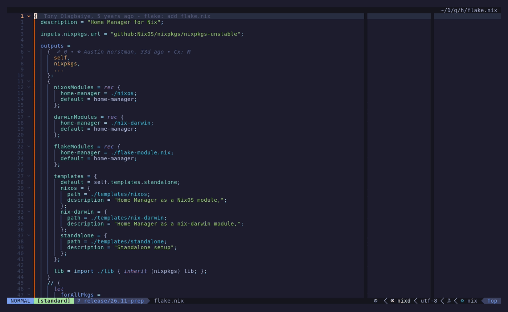

# neotest-nix

[](https://github.com/khaneliman/neotest-nix/actions/workflows/ci.yml)
[](https://luarocks.org/modules/khaneliman/neotest-nix)
[](./LICENSE)

A [Neotest](https://github.com/nvim-neotest/neotest) adapter for running Nix
tests directly from Neovim.

It discovers two kinds of tests in a flake-based project and runs them in place:

- **Flake checks** — `checks.<system>.<name>` derivations, including NixOS VM
  tests with a `testScript`. Run with `nix`.
- **nix-unit tests** — attribute sets shaped `{ expr = ...; expected = ...; }`
  (or `expectedError`). Run with [`nix-unit`](https://github.com/nix-community/nix-unit).

## Demo



<!-- Regenerate with: nix run nixpkgs#vhs -- demo.tape -->

## Features

- Discovers flake `checks` and `nix-unit` suites straight from tree-sitter, so
  the test tree appears without evaluating the flake.
- Runs the right tool per test — `nix build`/`nix flake check` for checks,
  `nix-unit` for unit suites.
- Streams command output live and reports pass/fail per position.
- Turns Nix evaluation/build errors into diagnostics at the originating source
  line, translating `/nix/store/...-source` paths back to your worktree.
- Attributes NixOS VM test failures to the line in the failing `testScript`.
- Optionally evaluates the flake to surface generated checks that are not
  visible in the source (off by default).

## Requirements

- Neovim >= 0.11
- [Nix](https://nixos.org/) on `PATH`. The adapter passes
  `--extra-experimental-features` for its own `nix` calls, so these features do
  not need to be enabled globally in your Nix config.
- [`nix-unit`](https://github.com/nix-community/nix-unit) on `PATH` (only for
  nix-unit tests)
- Plugin dependencies: [`neotest`](https://github.com/nvim-neotest/neotest)
  and [`nvim-nio`](https://github.com/nvim-neotest/nvim-nio)
- The `nix` tree-sitter grammar on your runtimepath (a `parser/nix.so`).
  Positions are parsed through Neovim's built-in `vim.treesitter`, so any
  source of the grammar works — `nvim-treesitter`, a manually built parser, or
  the `parser_runtime_paths` option below

Run `:checkhealth neotest-nix` to verify the requirements above are met.

## Installation

### lazy.nvim

```lua
{
  "nvim-neotest/neotest",
  dependencies = {
    "nvim-neotest/nvim-nio",
    -- Only needed to install the `nix` grammar; the adapter itself uses
    -- Neovim's built-in vim.treesitter. Any grammar source works.
    "nvim-treesitter/nvim-treesitter",
    "khaneliman/neotest-nix",
  },
  opts = function()
    return {
      adapters = {
        require("neotest-nix"),
      },
    }
  end,
}
```

If you configure Neotest directly rather than through `opts.adapters`:

```lua
require("neotest").setup({
  adapters = {
    require("neotest-nix"),
  },
})
```

### Nix (flake)

This repo ships an overlay that exposes `vimPlugins.neotest-nix`:

```nix
{
  inputs.neotest-nix.url = "github:khaneliman/neotest-nix";

  # in your nixpkgs config:
  nixpkgs.overlays = [ inputs.neotest-nix.overlays.default ];
}
```

The packaged plugin pulls in `neotest`, `nvim-nio`, and a grammar-only plugin
built straight from the upstream `tree-sitter-nix` grammar (no `nvim-treesitter`
dependency) as runtime dependencies.

## Usage

The adapter discovers tests like these straight from the source:

```nix
{
  outputs =
    { self, nixpkgs }:
    {
      # A flake check — run with `nix build`.
      checks.x86_64-linux.hello =
        nixpkgs.legacyPackages.x86_64-linux.runCommand "hello" { } "touch $out";

      # nix-unit assertions — run with `nix-unit`.
      tests = {
        testAddition = {
          expr = 1 + 1;
          expected = 2;
        };
      };
    };
}
```

Open a `flake.nix` (or a `*.nix` file with `test` in its name containing
nix-unit assertions) and use the standard Neotest commands:

```lua
require("neotest").run.run()              -- nearest test
require("neotest").run.run(vim.fn.expand("%")) -- whole file
require("neotest").summary.toggle()       -- test tree
```

## Configuration

All options are optional. Defaults shown:

```lua
require("neotest-nix")({
  -- Extra runtimepath roots containing parser/nix.so, in case the nix
  -- tree-sitter grammar is not already on your runtimepath.
  parser_runtime_paths = nil,

  -- Evaluate the flake to discover generated outputs that are not visible
  -- in the source (e.g. checks produced by a function). Off by default
  -- because it shells out to `nix eval`.
  discover_eval_checks = false,

  -- Which outputs to enumerate when discover_eval_checks is enabled.
  -- Each entry is { attr = <output>, match = <lua pattern, optional> }.
  eval_outputs = { { attr = "checks" } },

  -- Map function/`let`-wrapped nix-unit files (not evaluable standalone) to the
  -- flake installable that exposes them, run with `nix-unit --flake <flake>`.
  -- The output is auto-detected by evaluating the flake, so this is usually
  -- unnecessary; set it only to override detection. `path` may be absolute or
  -- relative to the flake root and matches the file or any directory above it.
  -- nix_unit_flakes = { { path = "lib/tests", flake = ".#tests" } },
  nix_unit_flakes = nil,
})
```

| Option | Type | Default | Description |
| ---------------------- | -------------------------- | -------------------- | ------------------------------------------------------------------------ |
| `parser_runtime_paths` | `string[]?` | `nil` | Extra runtimepath roots containing `parser/nix.so`. |
| `discover_eval_checks` | `boolean?` | `false` | Evaluate the flake to discover outputs not present in the source. |
| `eval_outputs` | `neotest-nix.EvalOutput[]?` | `{ { attr = "checks" } }` | Outputs to enumerate per system when `discover_eval_checks` is on. |
| `nix_unit_flakes` | `neotest-nix.NixUnitFlake[]?` | `nil` | Map wrapped nix-unit files to a flake installable, overriding auto-detection. |

## How discovery works

- `flake.nix` is always treated as a test file.
- Any other `*.nix` file is considered a test file only when its name **or its
  immediate parent directory** contains `test` **and** it contains a nix-unit
  assertion (`expr` plus `expected` or `expectedError`). This covers both
  `foo_test.nix` and the common `tests/default.nix` layout. A `lib.nix` holding
  nix-unit tests outside a `test`-named file or directory is not discovered.
- nix-unit assertions are surfaced as individual positions when their value has
  nix-unit shape (`expr` plus `expected` or `expectedError`). Attribute names do
  not need a `test` prefix; `addition` and `testAddition` both appear.
- Positions are parsed from source with tree-sitter. When
  `discover_eval_checks` is enabled, flake outputs are additionally enumerated
  via `nix eval` and merged into the tree, so checks generated at evaluation
  time still show up.

## Limitations

- Tests are only discovered inside a flake project. With no `flake.nix` at or
  above the file, the adapter does not apply.
- nix-unit runners evaluate the flake with `builtins.getFlake`, which sees only
  git-tracked files. A brand-new, untracked `flake.nix` or test file is
  invisible until it is staged or committed.
- Running a nix-unit suite (a `tests`-style namespace, or a function/`let`-wrapped
  file) runs the whole suite via `nix-unit --flake`, since it has no
  single-attribute filter — every attribute in that output reports a result.
- Running a whole `flake.nix` that mixes checks and nix-unit tests runs
  `nix flake check`, which does not execute nix-unit suites. Run the nix-unit
  namespace (or an individual test) to exercise them.
- Whole-suite runs use `nix-unit --flake`, which evaluates in pure mode and so
  needs a committed `flake.lock` with every input locked; otherwise the run
  fails with `cannot update unlocked flake input`. Individual tests run via
  `--expr` and are unaffected.

## Contributing

See [CONTRIBUTING.md](./CONTRIBUTING.md). Development happens inside the Nix
dev shell:

```sh
nix develop   # or: direnv allow
```

Run the checks the way CI does:

```sh
nix flake check --print-build-logs
```

## Acknowledgements

- [mrcjkb/neotest-haskell](https://github.com/mrcjkb/neotest-haskell) — used as
  a reference for the overall Neotest adapter shape, module boundaries, and
  integration patterns.
- [nvim-neotest/neotest](https://github.com/nvim-neotest/neotest) — the test
  framework this adapter plugs into.

## License

[MIT](./LICENSE) © Austin Horstman
